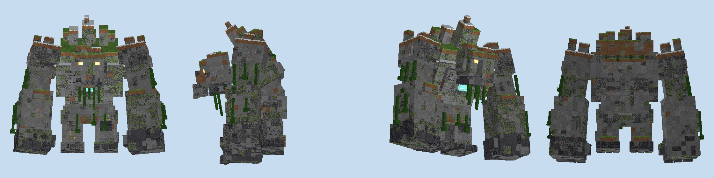
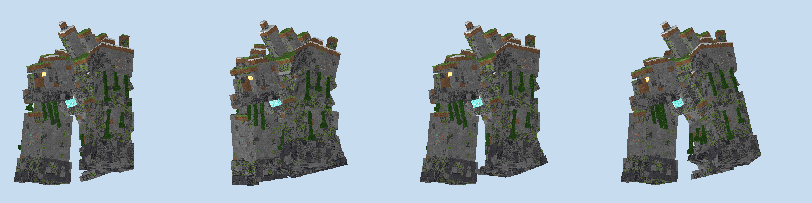
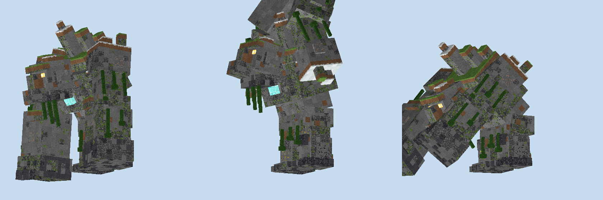
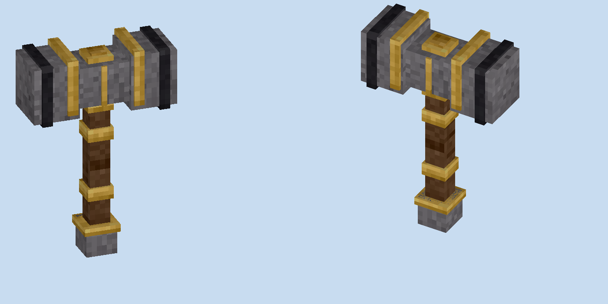
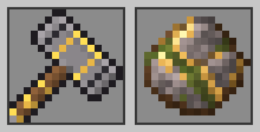

# Mountain Giant

A NeoForge 1.21.1 mod about one very large, very old thing that walks the plains at night.



Some nights the ground starts to shake. Footsteps come from somewhere past the treeline, getting louder. Then a shape
twenty-eight blocks tall stands up out of the mist and starts walking. It walks in a straight line, and it does not go
around anything.

By morning it's gone. What's left is a 28-block-wide scar across the plains, a few flattened houses, and whatever you
managed to knock off it.

---

## The giant

**There is only one.** A world never has more than one Mountain Giant at a time. It turns up on about one night in
three, some time between late evening and the small hours, somewhere fairly level and dry 48 to 96 blocks from a
player: plains, snowy plains or a meadow. You'll hear it about ten seconds before you see it.

**It isn't looking for you.** The giant is neutral. It walks, it tramples, and when it reaches the edge of its plains or
deep water it stops, looks around, and turns back. Leave it alone and it will leave you alone. Just don't stand next to
its feet: every step lands hard enough to hurt.

**It flattens things.** Everything in a 28-block-wide corridor gets pushed over: trees, fences, crops, walls. Gentle
slopes it just walks up. Real hills get a pass cut through them, climbing one block every eight. Houses and rock walls
get both fists brought down on them first, and the debris goes flying (along with anyone standing too close). Rivers
and ponds up to six blocks deep it wades straight through; lakes and the sea turn it back. Roughly 7% of what it breaks
drops as items.



**It holds a grudge, briefly.** Hit it, and it turns, roars, and comes after you. It's slower than you are on foot. It
gives up once you're 64 blocks away, once you leave the plains, or once 45 seconds pass without you hitting it again.
When it does reach you, it smashes the ground in front of it for up to 20 damage.



**At dawn it leaves.** It walks to the edge of the plains, the mist comes up, and it fades out. No drops, no corpse.
If you want what it's carrying, you have until sunrise.

## Taking it apart

600 health, 12 armor, immune to knockback and fire. Arrows and swords land on the arms and head as well as the body.

The giant is made of stone and ore, and it comes apart that way. Every 10% of health it loses, a cluster of ore breaks
off its body and scatters on the ground. You can see the gaps where it was.

| Health lost | Drops |
|---|---|
| 10% | 30 raw copper |
| 20% | 20 raw iron |
| 30% to 90% | 10 raw iron each time |
| Killed | 10 diamonds and the Mountain Heart |

The ten-notch boss bar lines up with those tiers.

## The Mountain Hammer





The Mountain Heart only comes from a giant, and the giant only comes some nights. Put it at the top of a crafting grid
between two iron blocks, with mossy cobblestone either side of a stick below and another stick under that:

```
[iron block] [mountain heart] [iron block]
[mossy cobble]    [stick]     [mossy cobble]
                  [stick]
```

| | |
|---|---|
| Attack damage | 11 |
| Attack speed | 1.0 |
| Mining | Everything a netherite pickaxe can dig, at speed 12 (netherite is 9) |
| Durability | 2031, repaired with iron blocks |
| Enchantments | Sharpness, Fire Aspect, Efficiency, Fortune, Silk Touch, Unbreaking, Mending |

**Three by three.** It digs a 3×3 square across whatever face you hit. Blocks harder than the one you aimed at are left
alone, so hitting stone won't take the obsidian next to it. Sneak to dig a single block.

**Giant's Slam.** Hold right click to lift the hammer over your head. After a second it locks in with a heavy clunk.
Let go and it comes down: a shockwave rolls out in three rings, hitting for about 12 within 3 blocks, 9 out to 5.5, and
6 out to 8, throwing everything outward. It doesn't hurt you and doesn't break blocks. Five seconds between slams.

With a shield in your off hand, right click raises the shield as usual and sneak + right click winds up the slam.

## Advancements

- **Mountain Breaker**: bring down a Mountain Giant.
- **With a Giant's Strength**: forge the Mountain Hammer.

## Commands

For operators, mostly for testing:

- `/mountaingiant omen` starts the tremors near you and brings the giant in, skipping the nightly roll.
- `/mountaingiant status` shows whether a giant is out, whether tonight rolled one, and the time of day.

The spawn egg is in the creative Spawn Eggs tab. Giants from the egg don't count against the one-per-world limit. In
daylight, once nobody has hit them for two minutes, they fade into the mist too.

## Installing

You need Minecraft Java 1.21.1 with NeoForge, and GeckoLib.

1. Install NeoForge for 1.21.1 using the installer from [neoforged.net](https://neoforged.net). It adds a NeoForge
   profile to the Minecraft Launcher.
2. Download GeckoLib for NeoForge 1.21.1 (4.9 or newer) from
   [Modrinth](https://modrinth.com/mod/geckolib) or [CurseForge](https://www.curseforge.com/minecraft/mc-mods/geckolib).
3. Put the GeckoLib jar and `mountain_giant-1.0.0.jar` into the `mods` folder of your game directory
   (`%APPDATA%\.minecraft\mods` on Windows unless the profile uses its own directory).
4. Start the NeoForge 1.21.1 profile.

## Building from source

```
cd mod
gradlew build            # jar ends up in mod/build/libs/
gradlew runClient        # development client
gradlew runGameTestServer
```

The game tests run the giant through a flat field, a stone ring, a moat, scattered ponds, a hill, a ring of houses and a
forest, check the chase, the ore tiers, the arm hitboxes, the dawn exit, natural spawning, the hammer's shockwave and
its 3×3 digging. They take about a minute.

---

## 中文简介

山岭巨人是一个 NeoForge 1.21.1 模组。某些夜晚，大地会先颤动，远处传来脚步声，随后一个 28 格高的石头巨人从雾中站起，
沿直线穿过平原，把挡路的树木、房屋和山坡一路踏平，浅河直接蹚过，天亮时走进雾里消失。它平时不主动攻击，被打了才会追击和砸拳，
但站在它脚边或者砸拳的落点附近也会被波及。
巨人每损失 10% 的血量就会掉落一批粗铜或粗铁，击败后掉落 10 颗钻石和山岭之心。山岭之心可以合成山岭巨锤：
它既是武器也是镐，一次挖 3×3，还能蓄力砸地放出三圈冲击波。
